# 🎬 BookMyScreen

A full-stack movie ticket booking platform with **real-time seat locking, secure authentication, Razorpay payments, MongoDB transactions, and automated show management**.

BookMyScreen simulates the core workflow of a production movie-ticket booking system where multiple users can browse shows, select seats, temporarily lock them, make payments, and confirm bookings.

---

## 🚀 Key Features

- 🎥 Browse movies, theatres, and shows
- 💺 Real-time seat selection and locking
- ⚡ Redis-based temporary seat locks with TTL
- 🔄 Real-time seat updates using Socket.IO
- 💳 Razorpay payment integration
- 🔐 OTP-based authentication
- 🍪 JWT authentication using HTTP-only cookies
- ♻️ Automatic JWT refresh
- 📋 Booking history
- 🗄️ MongoDB transactions for booking consistency
- ⏰ Automated show creation and cleanup using cron jobs
- 📧 OTP delivery through email
- 🔒 Protected APIs
- 📱 Responsive frontend

---

# 🏗️ System Architecture

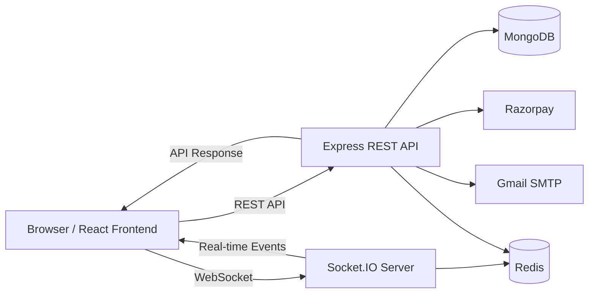

### Main Components

| Component | Responsibility |
|---|---|
| React | Frontend UI and application state |
| Express.js | REST API and business logic |
| MongoDB | Users, movies, shows and bookings |
| Redis | Temporary seat locking |
| Socket.IO | Real-time seat synchronization |
| Razorpay | Payment processing |
| JWT | Authentication |
| Nodemailer | OTP email delivery |
| Node-Cron | Automated show maintenance |

---

# 🎟️ Booking Flow

The booking process uses **Redis for temporary seat locking** and **MongoDB transactions for final booking**.

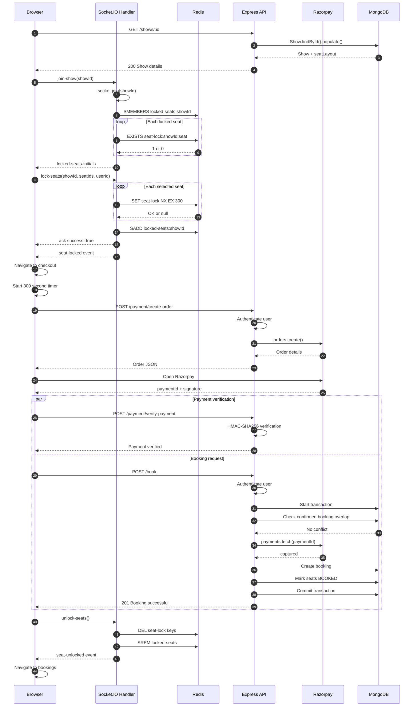

---

# 🔒 Redis Seat Locking

Temporary seat locking prevents multiple users from selecting the same seat during checkout.

Each seat receives a Redis key:

```text
seat-lock:<showId>:<seatId>
```

The lock is created using:

```text
SET key userId EX 300 NX
```

### Why `NX`?

`NX` ensures that the key is created **only if it does not already exist**.

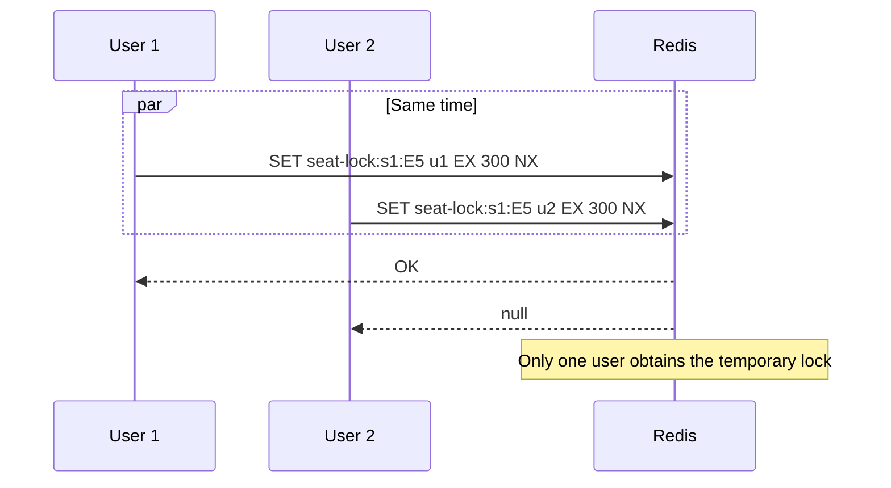

The lock automatically expires after **300 seconds**, preventing abandoned checkouts from permanently blocking seats.

---

# 👥 Concurrent Seat Booking

Redis provides the first layer of protection against two users selecting the same seat.

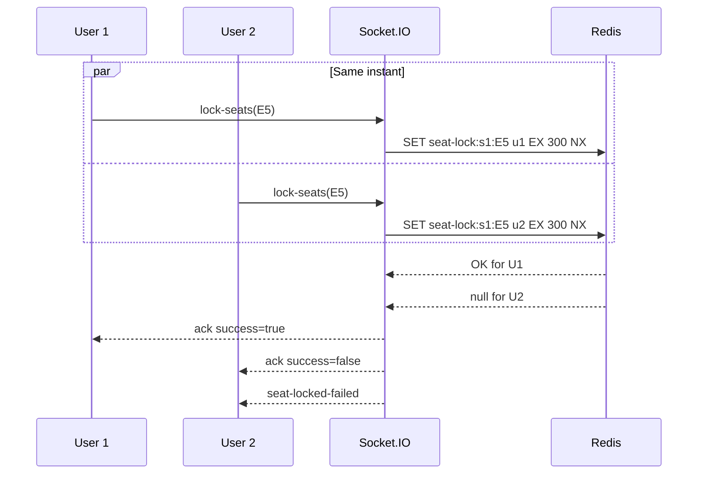

MongoDB provides an additional safety layer during final booking.

---

# ⚡ Real-Time Seat Updates

Socket.IO keeps users inside the same show synchronized.

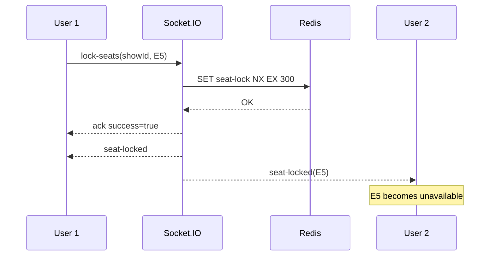

---

# 💳 Payment Flow

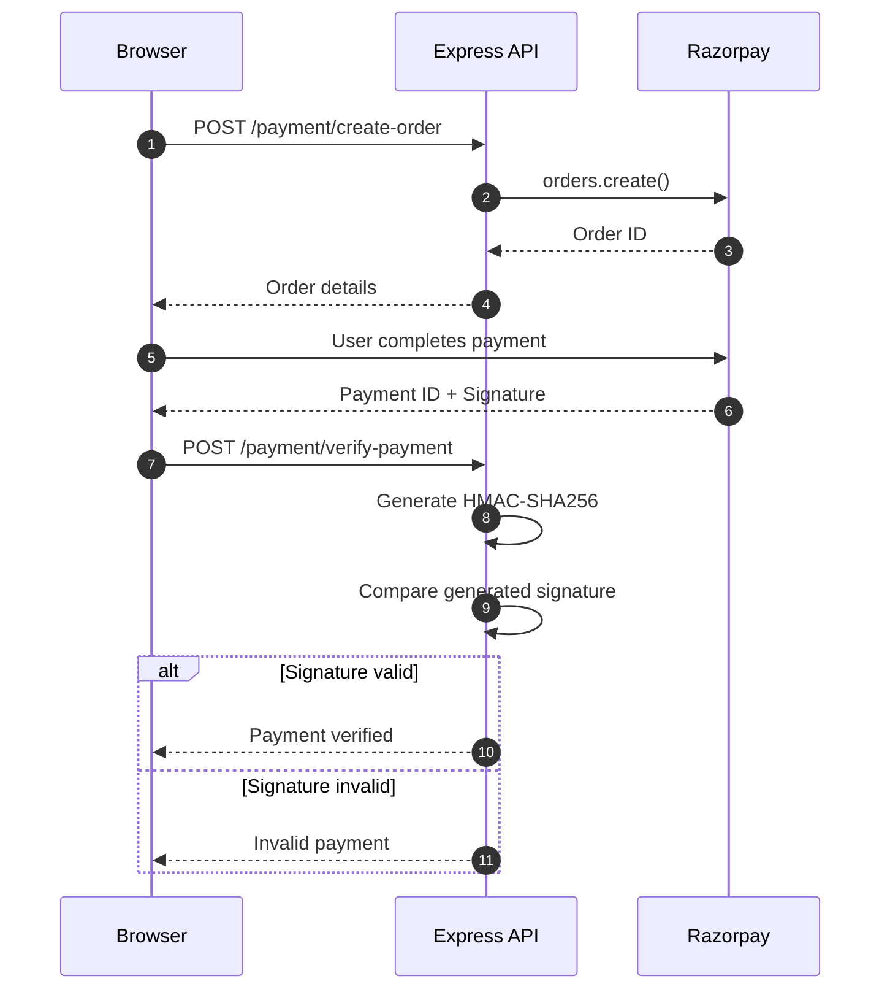

The backend also checks the payment status with Razorpay before creating the final booking.

---

# 🔐 Authentication

BookMyScreen uses an OTP-based authentication system.

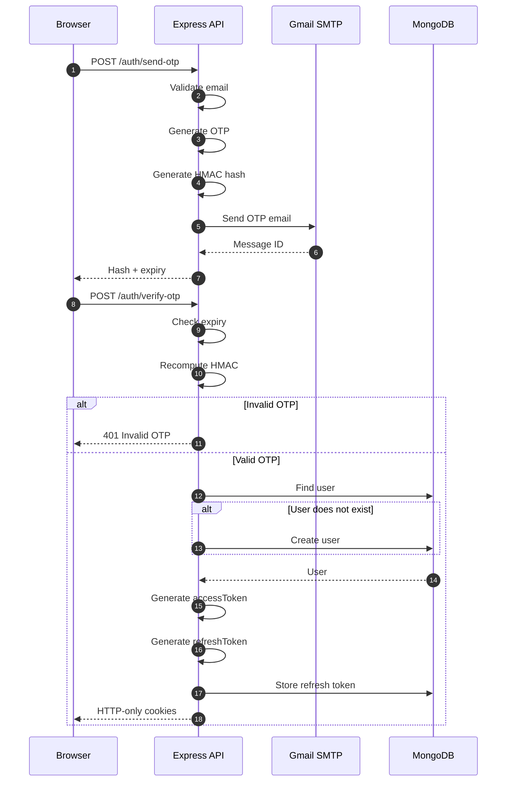

### Token Strategy

| Token | Lifetime | Purpose |
|---|---:|---|
| Access Token | 1 hour | Authenticate API requests |
| Refresh Token | 7 days | Generate new access token |

---

# ♻️ JWT Silent Refresh

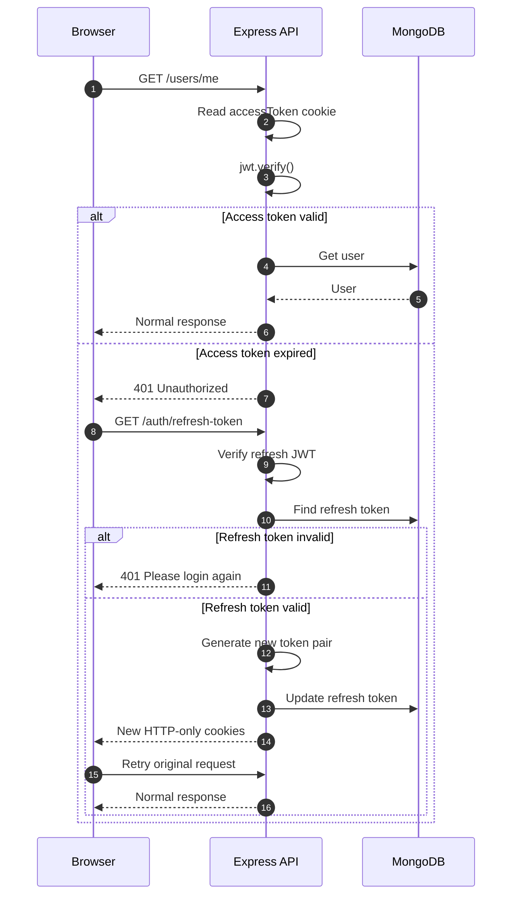

---

# 🚪 Logout

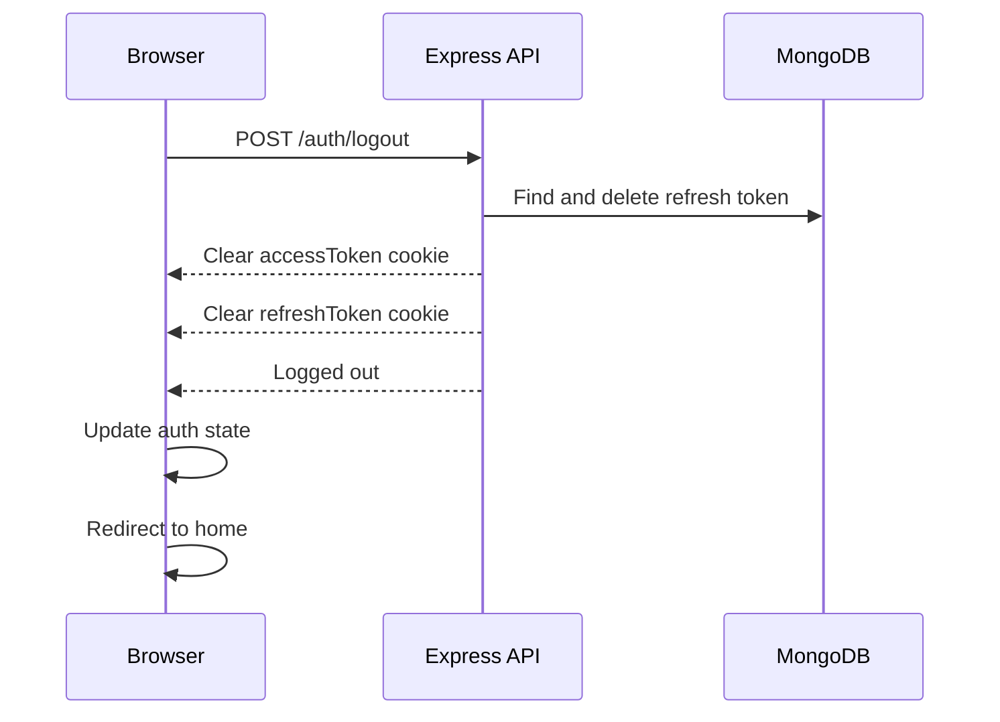

> **Note:** The existing access token can remain valid until its expiration because JWT access tokens are stateless.

---

# 🔌 Socket.IO Lifecycle

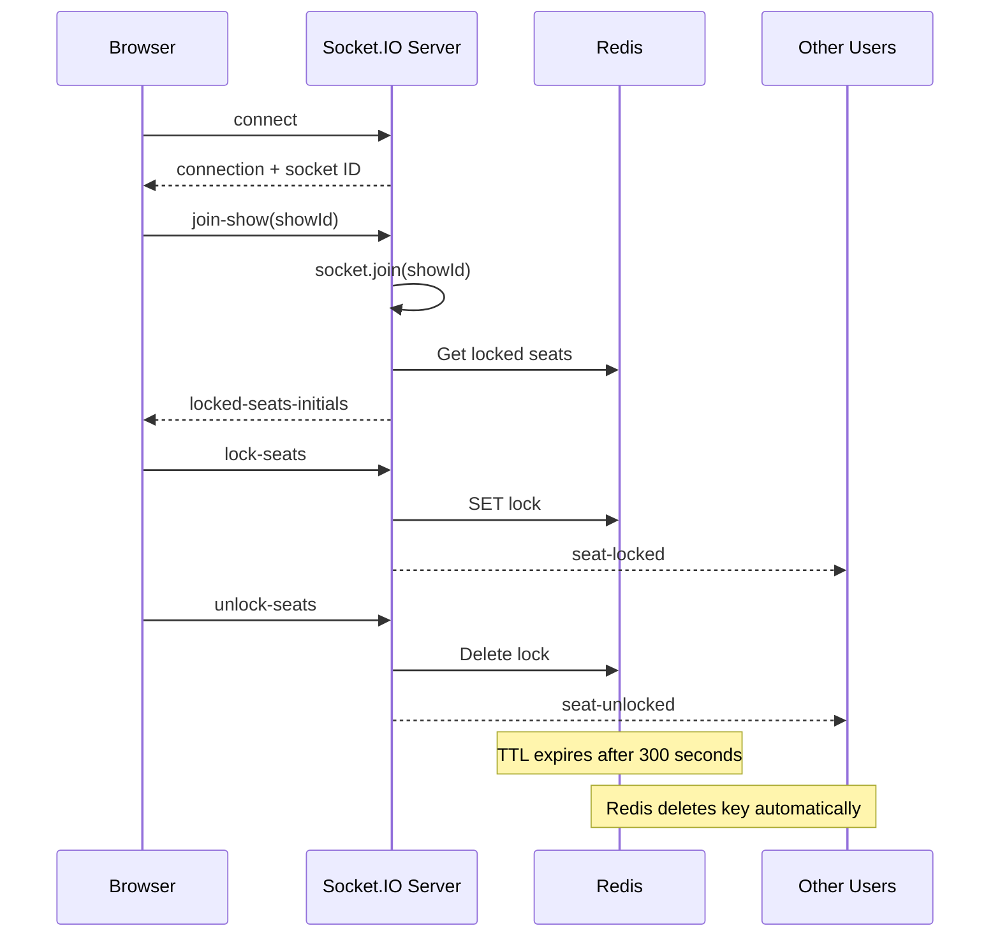

---

# ⏰ Show Maintenance

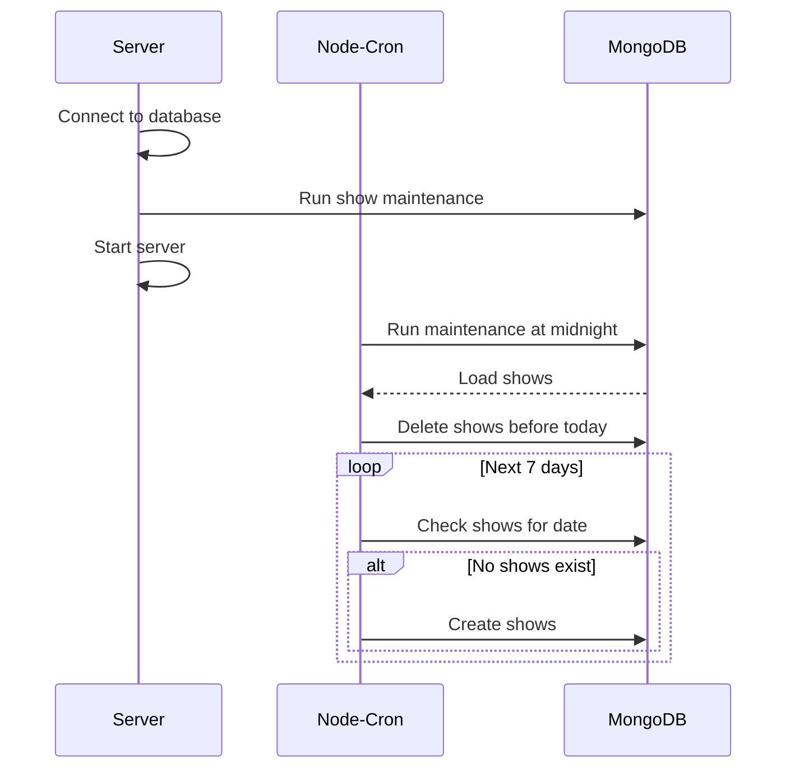

---

# 🗄️ Transactional Booking

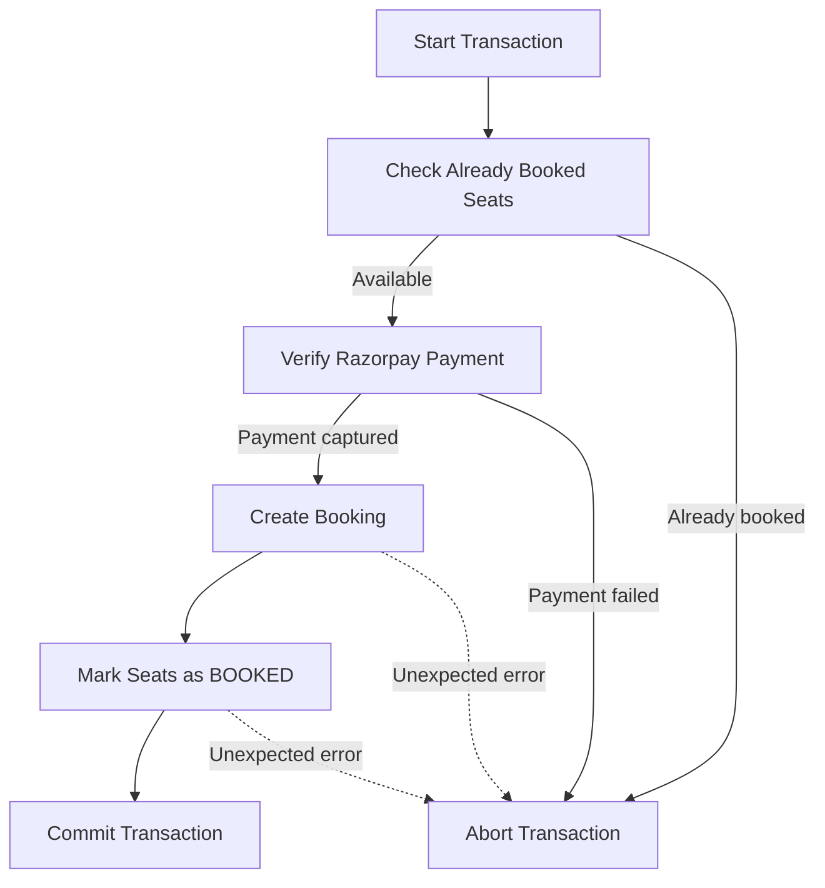

---

# 🔄 Complete Booking Architecture

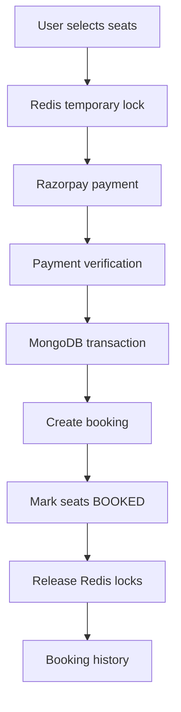

| Concern | Technology |
|---|---|
| Temporary seat lock | Redis |
| Real-time synchronization | Socket.IO |
| Payment | Razorpay |
| Permanent booking | MongoDB |
| Authentication | JWT |
| OTP delivery | Nodemailer |
| Scheduled maintenance | Node-Cron |

---

# ⚠️ Known Limitations

## 1. Redis TTL Expiry Is Silent

When a seat lock expires after 300 seconds, Redis automatically removes the key, but the current implementation does not emit a Socket.IO event.

**Possible improvement:** Redis keyspace notifications or a dedicated expiration/reconciliation mechanism.

## 2. Socket.IO Reconnection

After a network disconnect, Socket.IO can reconnect using a new socket, but the current client does not automatically rejoin the previous show room.

**Possible improvement:** Store the active `showId` and re-emit `join-show(showId)` after reconnection.

## 3. Payment Succeeds but Booking Fails

A payment can be captured while the subsequent booking transaction fails. The current implementation does not have an automated refund or reconciliation workflow.

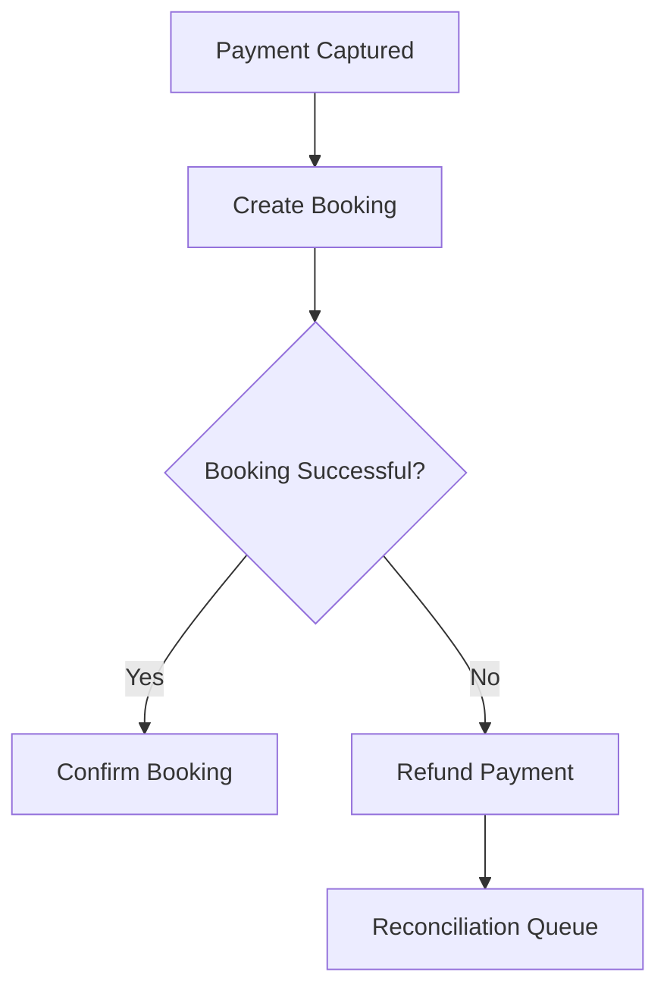

## 4. Logout and Access Token Lifetime

Logout invalidates the refresh token and clears cookies, but an already-issued access token can remain valid until expiry.

## 5. Payment Verification Error Handling

The current implementation has a missing `return` after a failed payment verification response, which can result in:

```text
Error: Cannot set headers after they are sent to the client
```

---

# 🛠️ Tech Stack

## Frontend
- React
- Vite
- Tailwind CSS
- Axios
- Socket.IO Client

## Backend
- Node.js
- Express.js
- Socket.IO
- JWT
- Nodemailer

## Database & Infrastructure
- MongoDB
- Redis
- Docker

## Payment
- Razorpay

## Development Tools
- Git
- GitHub
- Postman
- Docker
- VS Code

---

# ⚙️ Local Setup

## 1. Clone the Repository

```bash
git clone <repository-url>
cd BookMyScreen
```

## 2. Install Dependencies

```bash
cd client
npm install

cd ../server
npm install
```

## 3. Configure Environment Variables

### Backend

```env
MONGO_URI=
DB_NAME=
ACCESS_TOKEN_SECRET=
REFRESH_TOKEN_SECRET=
REDIS_URL=
RAZORPAY_KEY_ID=
RAZORPAY_KEY_SECRET=
SMTP_HOST=
SMTP_PORT=
SMTP_USER=
SMTP_PASSWORD=
```

### Frontend

```env
VITE_API_URL=
VITE_SOCKET_URL=
VITE_RAZORPAY_API_KEY=
```

## 4. Start the Application

```bash
# Backend
cd server
npm run dev

# Frontend
cd client
npm run dev
```

---

# 🐳 Docker

```bash
docker compose up --build
```

---

# 🧠 Core Engineering Concepts

- REST API design
- Authentication & authorization
- OTP authentication
- JWT access/refresh token architecture
- HTTP-only cookies
- Redis distributed locking
- TTL-based resource reservation
- WebSocket communication
- Socket.IO rooms
- Payment gateway integration
- HMAC signature verification
- MongoDB transactions
- Race-condition handling
- Database consistency
- Background jobs
- Error handling middleware
- Docker-based development

---

# 🔮 Future Improvements

- [ ] Automatic seat-unlock events after Redis TTL expiration
- [ ] Automatic Socket.IO room rejoin after reconnection
- [ ] Razorpay webhook integration
- [ ] Automatic payment refund/reconciliation
- [ ] Idempotency for payment and booking APIs
- [ ] Improved distributed booking guarantees
- [ ] Centralized logging and monitoring
- [ ] Rate limiting for authentication and payment APIs
- [ ] Redis adapter for horizontally scaled Socket.IO servers
- [ ] Automated integration tests
- [ ] End-to-end booking tests
- [ ] CI/CD pipeline

---

# 🎯 Engineering Objective

BookMyScreen demonstrates how a real-world booking system handles:

```text
Concurrency
     ↓
Temporary Resource Locking
     ↓
Payment Processing
     ↓
Payment Verification
     ↓
Transactional Persistence
     ↓
Real-Time Synchronization
     ↓
Confirmed Booking
```

# 👨‍💻 Developer
**Vansh Gupta**
---

⭐ If you find the project useful, consider giving the repository a star.
